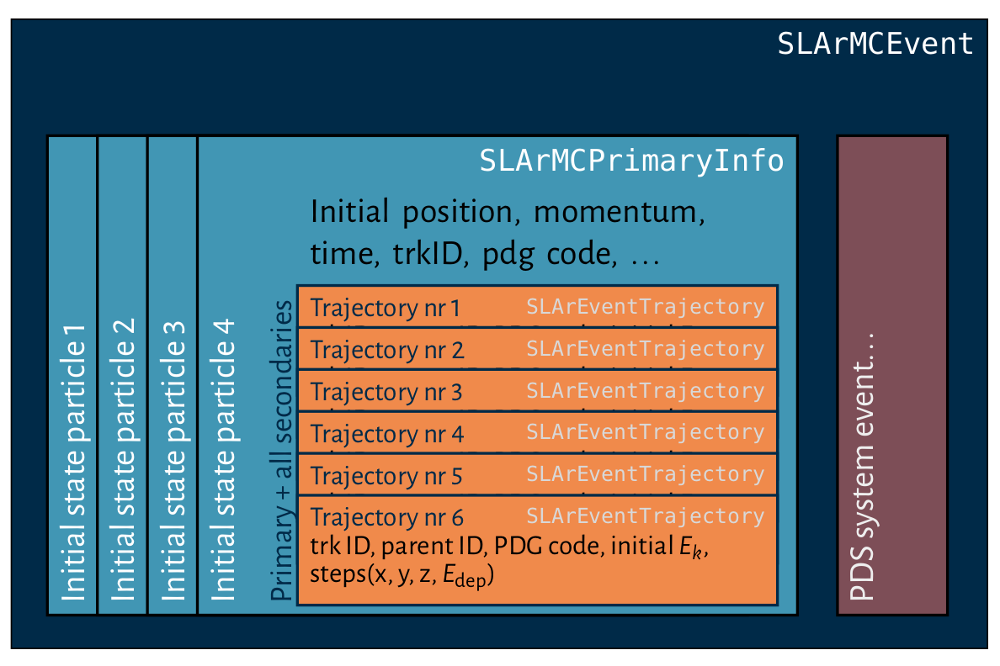
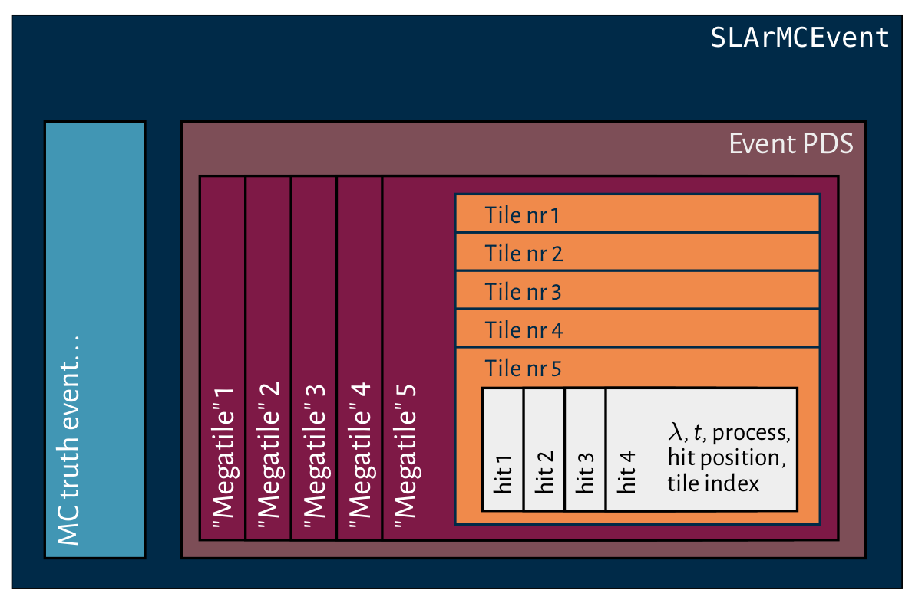

# ENUDet

**ENUDet** implements a Geant4-based Monte Carlo simulation of a generic LAr TPC
for studying beam events in the context of the ENUBET experiment. 

## Disclaimer
This code has never been properly tested, but there are some reasonable 
expectations for it to work on a Linux machine. While offering my sincerest
sympathies for your struggles, I cannot bear the responsibility for other 
developers' tears. 

In the source code one may find large sections commented and ``peculiar'' 
choices for some names (such as _Tank_ to indicate the cryostat). 
This is happening because a large part of this code is based on a MC simulation 
I developed for WbLS optical neutrino detector. 
Hopefully, a more appropriate naming convention will gain ground.

## Prerequisites (on a Linux machine)

- **Core:** `Geant4` `v11.0` and newer, **compiled without `MULTI_THREAD` support**, 
  `ROOT` (possibly compiled from source)
  and respective dependencies (`cmake`, `g++`, `gcc`)
- **Generators:** `SOLAr-sim` integrates some external events generators that
  are relevant for the physics goal of the project. 
  * **MARLEY**: Low-energy neutrino interactions in LAr
  * **BxDecay0**: Generic radioactive decay generator, with the possibility 
    of producing neutrinoless *ββ*-decay final states.
- **Utilities**: `SOLAr-sim` uses the `RapidJSON` package to parse configuration 
  files formatted according to the `json` standard. 
    
  At the preset state of the development, these three packages have to be installed
  manually by the user. The `SOLAr-sim` package includes a convenient script 
  to automatically download, build and install the external dependencies
  (see [External dependencies installation and configuration](README_EXTERNALS.md)). 
  
## Download and build the project

The procedure to build the code have some subtle differences wether one is 
installing the simulation on a [generic machine](#installing-SOLAr-sim-on-a-generic-machine)
or on a more complex system 
such as the [CERN computing environment](#installing-SOLAr-sim-on-cern-lxplus). 

### Installing G4SOLAr on CERN lxplus
#### Step 1 - Download the project from github, setup the environment and install dependencies
```bash
$ git clone https://github.com/dguff/G4SOLAr.git
$ git checkout enudet
```
After cloning the repository, setup the needed dependencies that are already 
installed on the FNAL ecosystem by sourcing the `setup_g4solar.sh` script. 
```bash
$ cd G4SOLAr
$ source setup_g4solar_lxplus.sh
```
If the project dependencies are not yet installed, follow the instructions
on [this page](./README_EXTERNALS.md).


#### Step 2 - Build

Create a build and install directory, then build and install the project
```bash
$ mkdir build install && cd build 
$ cmake -DGeant4_DIR=${GEANT4_DIR} -DCLHEP_EXTERNAL=${CLHEP_INC} -DCMAKE_INSTALL_PREFIX=../install [opts...] ../G4SOLAr
$ make
$ make install
```
The project will search for the external dependencies in the 
`G4SOLAR_EXT_DIR` (by default set to `G4SOLAr/extern/`). You can 
specify a specific installation directory by setting it in the `cmake`
command line (`-DG4SOLAR_EXT_DIR=/my/g4solar_ext/path`). 
Note that the geant4 version installed on `dunegpvm` nodes is compiled 
against an independent installation of `CLHEP`, so one has to specify the 
`CLHEP` include directory when calling `cmake`.

### Installing ENUDet on a generic machine
#### Step 1 - Download the project from github and install dependencies
```bash
$ git clone https://github.com/dguff/G4SOLAr.git
$ git checkout enudet
```
If the project dependencies are not yet installed, follow the instructions
on [this page](./README_EXTERNALS.md).

#### Step 2 - Build
Create a build and install directory, then build and install the project
```bash
$ mkdir build install && cd build 
$ cmake -DGeant4_DIR=/path/to/geant4/install -DCMAKE_INSTALL_PREFIX=../install [opts...] ../G4SOLAr
$ make
$ make install
```
The project will search for the external dependencies in the 
`G4SOLAR_EXT_DIR` (by default set to `G4SOLAr/extern/`). You can 
specify a specific installation directory by setting it in the `cmake`
command line (`-DG4SOLAR_EXT_DIR=/my/g4solar_ext/path`). 

### Run G4SOLAr

It is possible to run the simulation directly from the installation folder, but it
is advised to add the build directory to the executable PATH to be able to run 
the simulation more flexibly on your machine
```bash
$ cd install
$ export PATH=${PWD}:${PATH}
```

The `solar_sim` executable can take the following inputs:
```bash
solar_sim      [-m/--macro macro_file]            #<< Geant4 mac file
               [-r/--seed user_seed]              #<< User defined seed
               [-g/--geometry geometry_cfg_file]  #<< Geometry description
               [-p/--materials material_db_file]  #<< Material definition table
               [-h/--help print usage]
```

The first input (`-m`, `--macro`) is the configuration file for the 
Geant4 run. There one can specify the type of generated events, 
their number, the output file, etc. A collection of examples can 
be found in the `macros/` folder. The commands defined in the messenger
classes are briefly commented in the macro files. 

The second input (`-s`, `--seed`) is the random engine seed provided by the user.

The third input (`-g`, `--geometry`) is the `json` configuration file describing
the dimensions of the detector and of all the sub-systemd. 

Finally, the fourth input (`-p`, `--materials`) is a json table containing
the definitions of all materials used in the simulation. 

If no geometry or material table are provided, the simulation will take 
by default `assets/geometry/geometry.json` and `assets/materials/materials_db.json`
respectively. 

## Interpreting the output

The output file consists in a ROOT Tree containing the full development of 
an event at the step-level and the information from the photon detection 
system. These two distinct set of informations are stored into a 
`SLArMCEvent` object, which in turn contains a vector of `SLArMCPrimaryInfo`
(one for each particle in the initial state) and the PDS event object 
(`SLArEventReadoutTileSystem`). 

### Primary info

In addition to its own trajectory, each "primary" carries 
the trajectories of all secondary particles associated with the primary track.
The points of each trajectory are defined by their spatial coordinates and by 
the energy deposited in the step. 

The "hierarchical" structure of the primary information object is represented 
in the figure below (Fig. 1)

|            |
| :--:                                                                         |
| **Fig. 1** Box diagram showing the structure of a SLArMCPrimaryInfo object   |


### Photon Detection System Info

The photon hits recorded by the photon detection system are recorded in 
a dedicated event object. In the case of readout tiles, with each tile mounting
up to 100 SiPM, the detected photons are grouped together in a single score. 

TODO: add to the photon hit attributes the identification of the specific SiPM
responsible for the detection. 

Figure 2 schematically represents the structure of the ReadoutTile-based 
PDS event object.

|                                                 |
| :--:                                                                                                 |
| **Fig. 2** Schematic representation of the event class for the PDS based on the readout tile concept |


### ENUDet Event Dictionaries

To be able to access the event information in an interactive ROOT session, 
one should load the shared libraries defining the event and configuration 
objects. 
These libraries are built when compiling `SOLAr-sim` and are installed in 
the `G4SOLAR_INSTALL_DIR/lib` folder. During the installation process, 
a `rootlogon.C` file loading the libraries is created in 
`G4SOLAR_BASE_DIR/SOLArAnalysis`. In the same folder, one can
find the script `test_output.C`, which can serve as an example for accessing
simulated MC event. 

### Running jobs on the grid

#### CERN
Work in progress

#### FNAL
You can run SOLAr-sim jobs on the grid with

```
cd grid
source setup_g4solar_grid.sh
python jobsub.py [options]
```

You can see all the available options with `python jobsub.py -h`

`jobsub.py` uses a template macro to run the jobs. The current available template is `template_g4solar_electrons.mac`.
To run other types of events, more templates will have to be added. 

TODO: add a full macro file writer


